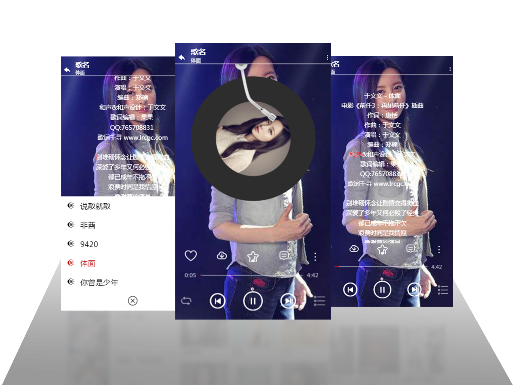
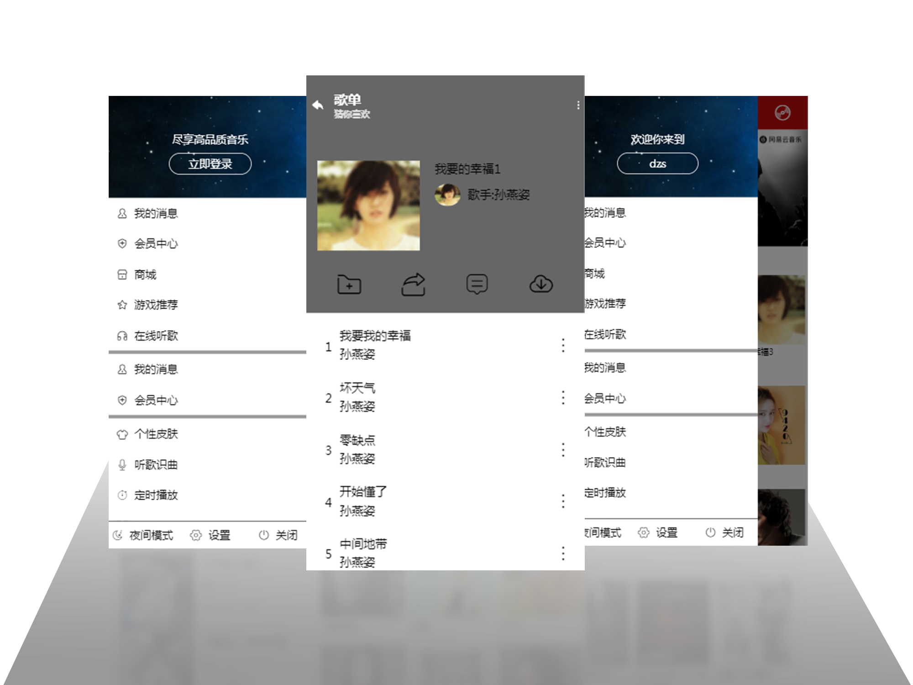
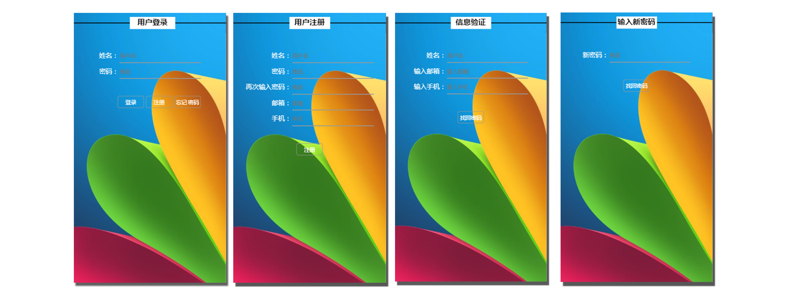

# myMusicPlayer
## 技术栈
###### vue + vuex + vue-router + vue-axios + vue-awesome-swiper+node+mongodb
## 功能实现
- [X] 音乐首页
    - [X] header导航栏切换：个人信息页、音乐首页、发现页面、电台页面、播放页面
    - [x] 轮播图
    - [x] 专辑推荐，点击专辑进入专辑详情页
        - [x] 专辑详情页点击对应歌曲进入播放页面，标识当前专辑正在播放的歌曲
    - [x] 热歌推荐，点击歌曲进入播放页面，标识正在播放歌曲
- [X] 播放页面
    - [x] 播放和暂停音乐，上一首，下一首，快进，快退
    - [x] 上一首、下一首或另一首歌曲等切歌播放界面图片更新
    - [x] 列表播放，随机播放，单曲循环
    - [x] 播放歌单列表点击显示/隐藏，点击歌曲也可以播放
    - [x] 歌曲总时长、播放当前时间，进度条同步
    - [x] 点击进度条实现快速/后退
    - [x] 歌词显示/隐藏、歌词滚动、当前歌词红色高亮
- [X] 个人页面，个人信息展示,实现登陆、注册，修改密码
- [X] 发现页面：完成静态页面
- [X] 电台页面：完成静态页面

###### 页面截图





## 本地运行
```
打开项目文件夹npm i下载开发依赖，npm run dev运行项目
打开服务文件夹之前先运行数据库，mongod --dbpath c:/存放数据的文件名
打开服务文件夹，npm i下载依赖，npm start运行后台环境。
打开浏览器输入127.0.0.1:8081
```